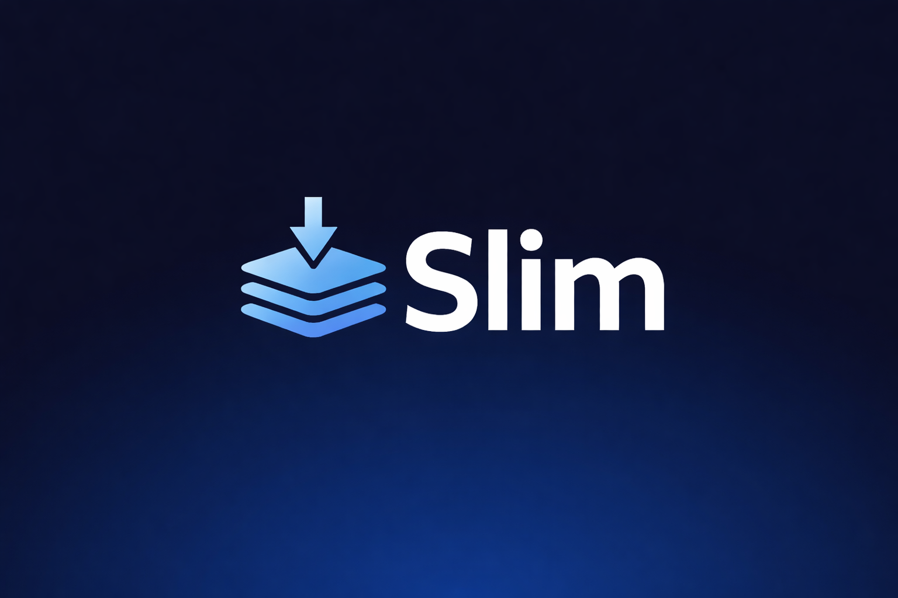

# ⚡️ mcp-slim



**mcp-slim** is an open-source developer tool designed to dramatically reduce the token usage of Model Context Protocol (MCP) tool schemas. It compresses verbose JSON schemas into lightweight "skill signatures," allowing your AI CLI (like Gemini or Claude) to handle more tools while keeping your context window focused and efficient.

---

## 🚀 The Problem
MCP tool schemas are often extremely verbose, consuming thousands of tokens just to describe a few tools. This leads to:
- Faster context window exhaustion.
- Increased latency.
- Higher costs for LLM API usage.

## 🛠 The Solution
`mcp-slim` reads your existing MCP configurations and generates **Skill Signatures**. Instead of a 20-line JSON object for a single tool, it produces a single-line signature:
`create_issue(repo, title, body)`

This results in an estimated **~90% reduction** in tool-related token overhead.

---

## ✨ Features
- **Zero-Modification**: Reads your MCP configs without changing them.
- **Native Integration**: Works as a native slash command (`/slim`) in Gemini and Claude CLIs.
- **Auto-Sync**: Background hooks keep your tool signatures in sync with your actual MCP servers.
- **Lightweight**: Built with TypeScript and SQLite for fast, local-only performance.
- **Transparent**: Inspect raw schemas and generated signatures at any time.

---

## 📦 Installation

### 1. Build and Link
```bash
git clone [https://github.com/jayanthchandra/Slim.git](https://github.com/jayanthchandra/Slim.git) mcp-slim
cd mcp-slim
npm install
npm run build
npm link
```

### 2. Initialize
Run the initialization command to detect your MCP servers and generate the local registry.
```bash
slim init
```

## 📦 Installation as AI CLI Extension

Install `slim` natively in your favorite AI CLI using these commands:

<details>
<summary><b>♊️ Gemini CLI / 📜 Codex</b></summary>

```bash
# Install as a native extension
gemini extensions install https://github.com/jayanthchandra/Slim.git
```
*Note: This automatically registers the `/slim` slash command.*
</details>

<details>
<summary><b>👤 Claude Code</b></summary>

```bash
# Add as a plugin
claude plugin add https://github.com/jayanthchandra/Slim.git
```
*Note: This enables `/slim` as a native plugin command.*
</details>

<details>
<summary><b>🤖 Qwen CLI</b></summary>

```bash
# Install as a native extension
qwen extensions install https://github.com/jayanthchandra/Slim.git
```
*Note: This enables `/slim` using the Qwen-native markdown command format.*
</details>

---

## 🎮 Usage

Once installed, you can use the following commands directly in your AI CLI session:

| Command | Description |
| :--- | :--- |
| `/slim init` | Full initialization and registry build. |
| `/slim update` | Rebuild signatures if MCP config has changed. |
| `/slim status` | Show servers, tools, and estimated token savings. |
| `/slim inspect` | Display all currently generated signatures. |
| `/slim scrub` | Reset the system and delete local state. |

---

## 📂 Project Structure
- `cli/`: Command handlers and the main router.
- `core/`: Core logic for compression, hashing, and configuration.
- `storage/`: SQLite registry and file path management.
- `hooks/`: Background sync hooks.
- `tests/`: Comprehensive Jest test suite.

---

## 🛠 Development
To run tests:
```bash
npm test
```

To watch for changes during development:
```bash
npx tsc -w
```

---

## 📄 License
MIT License - feel free to use, modify, and distribute.

---

**Built with ❤️ for the MCP ecosystem.**
